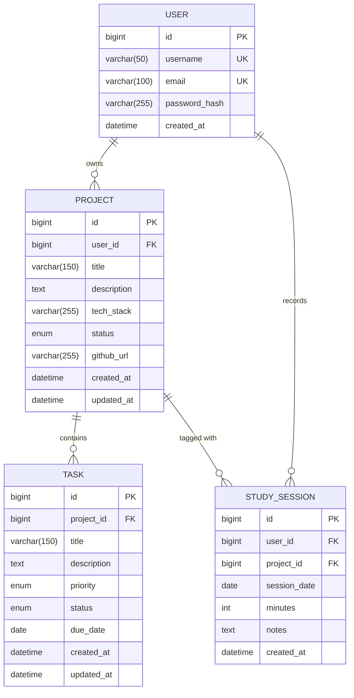

# Entity-Relationship Diagram — DevTrack AI v1

## Mermaid ERD

## Entity Descriptions

### User
Central entity. Email is used as the Spring Security principal. Password stored as BCrypt hash — never in plain text.

### Project
Belongs to one User. `status` enum: `IDEA | ACTIVE | DONE`. `tech_stack` is a free-text comma-separated string (simple for MVP, can be normalised in v2).

### Task
Belongs to one Project (cascade delete). `priority` enum: `LOW | MEDIUM | HIGH`. `status` enum: `TODO | DOING | DONE`.

### StudySession
Belongs to User. Optionally tagged to a Project (nullable FK) — justification: users may study general topics not tied to a specific project (e.g. algorithms, books). Keeping `project_id` nullable avoids forcing artificial project creation.

## Relationships Summary

| From | To | Cardinality | Notes |
|------|----|-------------|-------|
| User | Project | 1 : N | cascade delete future |
| User | StudySession | 1 : N | |
| Project | Task | 1 : N | cascade delete on remove |
| Project | StudySession | 1 : optional N | nullable FK |
